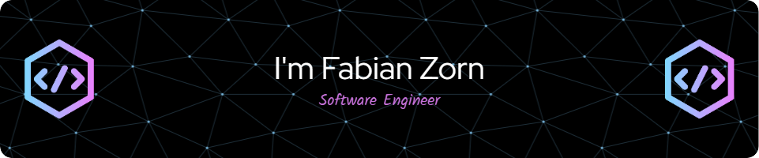

Hey there 👋

I’m Fabian Zorn, a software engineer, specializes in Java and Spring Boot.

Want to know more about me? [Check out my blog.](https://fabianzorn.netlify.app)

## 📈 GitHub Stats

 

 
 

## 💼 Skills

 

